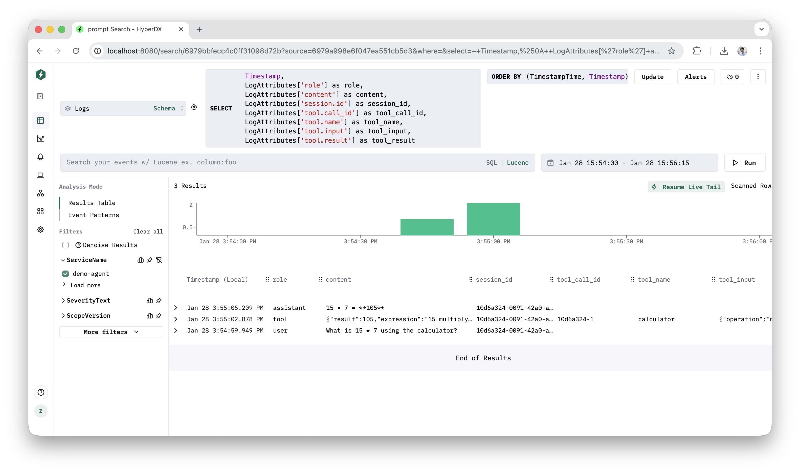

# ClickStack + Claude Agent SDK

Full trajectory tracing for Claude Agent SDK applications based on OpenTelemetry and ClickStack. Captures prompts, responses, and tool calls that are missing from Claude Code's built-in telemetry.



## Architecture

```
┌─────────────────────────────────────────────────────────────────────┐
│                         Claude Agent SDK                            │
├─────────────────────────────────────────────────────────────────────┤
│                                                                     │
│  ┌───────────────────────┐       ┌───────────────────────────────┐  │
│  │  Built-in Telemetry   │       │    Custom OTEL Logging        │  │
│  │  (Claude Code)        │       │    (demo-agent.ts)            │  │
│  ├───────────────────────┤       ├───────────────────────────────┤  │
│  │ • Token usage         │       │ • User prompts                │  │
│  │ • Cost tracking       │       │ • Agent responses             │  │
│  │ • Model info          │       │ • Tool calls (input + result) │  │
│  │ • Session metadata    │       │ • Session correlation         │  │
│  └───────────┬───────────┘       └───────────────┬───────────────┘  │
│              │                                   │                  │
└──────────────┼───────────────────────────────────┼──────────────────┘
               │                                   │
               │         OTLP gRPC (:4317)         │
               └─────────────┬─────────────────────┘
                             ▼
               ┌─────────────────────────────┐
               │    ClickStack (Docker)      │
               ├─────────────────────────────┤
               │  • OTEL Collector (:4317)   │
               │  • ClickHouse (storage)     │
               │  • HyperDX UI (:8080)       │
               └─────────────────────────────┘
```

## What This Solves

Claude Code's built-in OpenTelemetry integration doesn't capture:

- User prompts
- Agent responses
- Tool call inputs and results

This project adds custom OpenTelemetry logging to capture the complete agent trajectory, stored in ClickHouse via ClickStack.

## Setting up ClickStack

ClickStack is an all-in-one observability stack with 3 components:

- **ClickHouse** - Database for storing telemetry data
- **OpenTelemetry Collector** - Receives OTLP data (port 4317 gRPC, 4318 HTTP)
- **HyperDX** - UI for querying and visualizing data (port 8080)

Docs: https://clickhouse.com/docs/use-cases/observability/clickstack/getting-started

```bash
docker run \
  -p 8080:8080 \
  -p 4317:4317 \
  -p 4318:4318 \
  -v "$(pwd)/.volumes/db:/data/db" \
  -v "$(pwd)/.volumes/ch_data:/var/lib/clickhouse" \
  -v "$(pwd)/.volumes/ch_logs:/var/log/clickhouse-server" \
  clickhouse/clickstack-all-in-one:latest
```

Get the Ingestion API Key from HyperDX UI: **Team Settings > Ingestion API Key**

## Claude Code config

See [.env.example](.env.example) for the required environment variables.

Docs: https://code.claude.com/docs/en/monitoring-usage

## Logging Full Agent Trajectory with Claude Agent SDK

Claude Code's built-in telemetry doesn't include user prompts, responses, or tool call details. See `demo-agent.ts` for how to add custom OpenTelemetry logging to capture the full agent trajectory.

### Setup

1. Copy `.env.example` to `.env.local`
2. Set `OTEL_EXPORTER_OTLP_HEADERS` with your auth token (required for logs to be accepted)

```bash
# Install dependencies
npm install

# Run the demo agent (with ClickStack running)
npm run demo "What is 15 * 7 using the calculator?"
```

### Key implementation details

- Uses `@opentelemetry/exporter-logs-otlp-grpc` to send logs via gRPC to port 4317
- `OTEL_EXPORTER_OTLP_HEADERS` must be set for authentication
- `SimpleLogRecordProcessor` sends logs immediately (no flush needed)
- All logs include `session.id` for correlation
- Unified event type: `message` with `role` attribute (user/assistant/tool)

### Querying in ClickHouse

```sql
-- Query all trajectory events for a session
SELECT
  Timestamp,
  LogAttributes['session.id'] as session,
  LogAttributes['role'] as role,
  LogAttributes['content'] as content,
  LogAttributes['tool.name'] as tool,
  LogAttributes['tool.input'] as tool_input,
  LogAttributes['tool.result'] as tool_result
FROM otel_logs
WHERE ServiceName = 'demo-agent'
ORDER BY Timestamp DESC;

-- Query by role
SELECT
  Timestamp,
  LogAttributes['content'] as content,
  LogAttributes['session.id'] as session_id
FROM otel_logs
WHERE ServiceName = 'demo-agent'
  AND LogAttributes['role'] = 'assistant'
ORDER BY Timestamp DESC;

-- Query tool calls only
SELECT
  Timestamp,
  LogAttributes['session.id'] as session_id,
  LogAttributes['tool.call_id'] as tool_call_id,
  LogAttributes['tool.name'] as tool_name,
  LogAttributes['tool.input'] as tool_input,
  LogAttributes['tool.result'] as tool_result
FROM otel_logs
WHERE ServiceName = 'demo-agent'
  AND LogAttributes['role'] = 'tool'
ORDER BY Timestamp DESC;
```

## Captured fields (not in Claude Code built-in telemetry)

Unified `message` event with attributes:

- `role` - `user`, `assistant`, or `tool`
- `content` - message content
- `session.id` - session ID for correlation
- `tool.call_id`, `tool.name`, `tool.input`, `tool.result` - (tool role only)

## Sample Data

Sample CSV export: [sample_hyperdx_search_results.csv](sample_hyperdx_search_results.csv)

| Timestamp            | Role      | Content                                           | Session ID   |
| -------------------- | --------- | ------------------------------------------------- | ------------ |
| 2026-01-28T07:54:59Z | user      | What is 15 \* 7 using the calculator?             | 10d6a324-... |
| 2026-01-28T07:55:02Z | tool      | {"result":105,"expression":"15 multiply 7 = 105"} | 10d6a324-... |
| 2026-01-28T07:55:05Z | assistant | 15 × 7 = **105**                                  | 10d6a324-... |

## Fetching Session Logs

The `fetch-session.ts` script fetches logs for a session directly from ClickHouse and saves them to a text file. This bypasses the HyperDX UI and provides a clean, readable format.

```bash
# Using session ID prefix
npm run fetch 54d5f26c

# Using full session ID
npx tsx fetch-session.ts 54d5f26c-2621-4dcf-aa23-1f7cf8a9f627
```

Output is saved to `session-{id-prefix}.txt` with formatted messages:

```
Session: 54d5f26c-2621-4dcf-aa23-1f7cf8a9f627
Messages: 4
Fetched at: 2026-01-28T15:11:41.036Z

================================================================================
[2026-01-28T06:40:28.802Z] USER
================================================================================
List all available video sources...

================================================================================
[2026-01-28T06:40:37.017Z] TOOL
================================================================================
Tool: Bash

Input:
{
  "command": "./cli list sources",
  "description": "List all available video sources"
}

Result:
Sources (5 total):
...

================================================================================
[2026-01-28T06:40:52.273Z] ASSISTANT
================================================================================
## Available Video Sources
...
```

## Known Issues

### HyperDX UI Detail View Bug

When clicking on a log row to expand the detail view, the content may appear empty even though the data exists in ClickHouse. This affects some message types (particularly assistant responses).

**Workaround:** Use the `fetch-session.ts` script to export session logs directly from ClickHouse.

**Related issue:** https://github.com/hyperdxio/hyperdx/issues/1139

### ClickHouse Memory Limits

The ClickStack all-in-one container may run out of memory during background merge operations, causing ClickHouse to crash. Symptoms:

- `clickhouse-client` returns `Connection refused (localhost:9000)`
- Error in `/var/log/clickhouse-server/clickhouse-server.err.log`:
  ```
  memory limit exceeded: would use 1.74 GiB, maximum: 1.73 GiB
  ```

**Fix:** Restart the container:

```bash
# Find the container ID
docker ps

# Restart it
docker restart <container-id>
```

**Prevention:** Run Docker with more memory allocated, or use a separate ClickHouse instance with appropriate memory settings.
